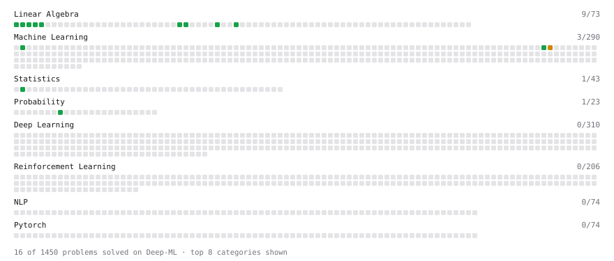

# Deep-ML

My machine learning practice from [Deep-ML](https://www.deep-ml.com). Every solution here was written by hand.

**11** solved · 8 problems · 0 labs · 3 math

[**Browse the interactive portfolio**](https://vakajeevanreddy.github.io/deep-ml/) to replay this filling in over time.

## Problems

| | Difficulty | Solved | |
| --- | --- | --- | --- |
| [Calculate Mean by Row or Column](https://www.deep-ml.com/problems/4) | easy | 2026-09-23 | [solution](problems/0004-calculate-mean-by-row-or-column) |
| [Derivative of a Polynomial](https://www.deep-ml.com/problems/116) | easy | 2026-05-30 | [solution](problems/0116-derivative-of-a-polynomial) |
| [Matrix-Vector Dot Product](https://www.deep-ml.com/problems/1) | easy | 2026-09-21 | [solution](problems/0001-matrix-vector-dot-product) |
| [Reshape Matrix](https://www.deep-ml.com/problems/3) | easy | 2026-09-21 | [solution](problems/0003-reshape-matrix) |
| [Scalar Multiplication of a Matrix](https://www.deep-ml.com/problems/5) | easy | 2026-09-23 | [solution](problems/0005-scalar-multiplication-of-a-matrix) |
| [Transpose of a Matrix](https://www.deep-ml.com/problems/2) | easy | 2026-09-21 | [solution](problems/0002-transpose-of-a-matrix) |
| [Product Rule for Derivatives](https://www.deep-ml.com/problems/309) | medium | 2026-05-30 | [solution](problems/0309-product-rule-for-derivatives) |
| [Quotient Rule for Derivatives](https://www.deep-ml.com/problems/312) | medium | 2026-05-31 | [solution](problems/0312-quotient-rule-for-derivatives) |

## Math

| | Difficulty | Solved | |
| --- | --- | --- | --- |
| [Derivatives and Gradients](https://www.deep-ml.com/math-problems/1) | easy | 2026-09-21 | [solution](math/0001-derivatives-and-gradients) |
| [Vector Operations](https://www.deep-ml.com/math-problems/7) | easy | 2026-09-23 | [solution](math/0007-vector-operations) |
| [Vector Norms and Linear Independence](https://www.deep-ml.com/math-problems/8) | medium | 2026-09-23 | [solution](math/0008-vector-norms-and-linear-independence) |

---

_This file is regenerated by Deep-ML on every push._
