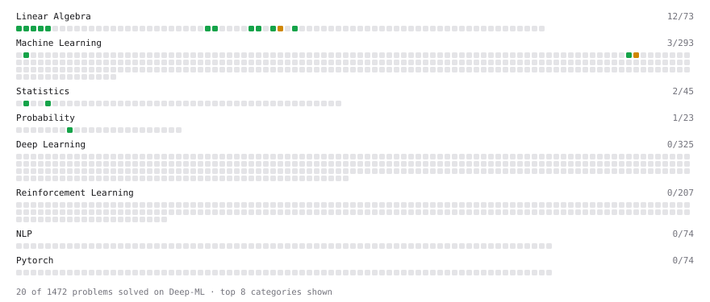

# Deep-ML

My machine learning practice from [Deep-ML](https://www.deep-ml.com). Every solution here was written by hand.

**67** solved · 39 problems · 0 labs · 28 math

[**Browse the interactive portfolio**](https://vakajeevanreddy.github.io/deep-ml/) to replay this filling in over time.

## Problems

| | Difficulty | Solved | |
| --- | --- | --- | --- |
| [Calculate Conditional Probability from Data](https://www.deep-ml.com/problems/168) | easy | 2026-10-06 | [solution](problems/0168-calculate-conditional-probability-from-data) |
| [Calculate Cosine Similarity Between Vectors](https://www.deep-ml.com/problems/76) | easy | 2026-09-23 | [solution](problems/0076-calculate-cosine-similarity-between-vectors) |
| [Calculate Mean by Row or Column](https://www.deep-ml.com/problems/4) | easy | 2026-09-23 | [solution](problems/0004-calculate-mean-by-row-or-column) |
| [Check Linear Independence of Vectors](https://www.deep-ml.com/problems/331) | easy | 2026-09-29 | [solution](problems/0331-check-linear-independence-of-vectors) |
| [Compute Posterior Probability using Bayes' Theorem](https://www.deep-ml.com/problems/336) | easy | 2026-10-07 | [solution](problems/0336-compute-posterior-probability-using-bayes-theorem) |
| [Compute the Cross Product of Two 3D Vectors](https://www.deep-ml.com/problems/118) | easy | 2026-10-06 | [solution](problems/0118-compute-the-cross-product-of-two-3d-vectors) |
| [Demonstrate Law of Large Numbers with Sampling](https://www.deep-ml.com/problems/342) | easy | 2026-10-07 | [solution](problems/0342-demonstrate-law-of-large-numbers-with-sampling) |
| [Derivative of a Polynomial](https://www.deep-ml.com/problems/116) | easy | 2026-05-30 | [solution](problems/0116-derivative-of-a-polynomial) |
| [Derivatives of Activation Functions](https://www.deep-ml.com/problems/217) | easy | 2026-10-03 | [solution](problems/0217-derivatives-of-activation-functions) |
| [Descriptive Statistics Calculator](https://www.deep-ml.com/problems/78) | easy | 2026-09-24 | [solution](problems/0078-descriptive-statistics-calculator) |
| [Dot Product Calculator](https://www.deep-ml.com/problems/83) | easy | 2026-09-23 | [solution](problems/0083-dot-product-calculator) |
| [Empirical Probability Mass Function (PMF)](https://www.deep-ml.com/problems/184) | easy | 2026-09-25 | [solution](problems/0184-empirical-probability-mass-function-pmf) |
| [Expected Value and Variance of an n-Sided Die](https://www.deep-ml.com/problems/179) | easy | 2026-09-24 | [solution](problems/0179-expected-value-and-variance-of-an-n-sided-die) |
| [Gradient Direction and Magnitude](https://www.deep-ml.com/problems/308) | easy | 2026-09-24 | [solution](problems/0308-gradient-direction-and-magnitude) |
| [Implement Orthogonal Projection of a Vector onto a Line](https://www.deep-ml.com/problems/66) | easy | 2026-09-30 | [solution](problems/0066-implement-orthogonal-projection-of-a-vector-onto-a-line) |
| [Linear Regression Using Gradient Descent](https://www.deep-ml.com/problems/15) | easy | 2026-09-24 | [solution](problems/0015-linear-regression-using-gradient-descent) |
| [Matrix Determinant & Trace](https://www.deep-ml.com/problems/195) | easy | 2026-09-29 | [solution](problems/0195-matrix-determinant-trace) |
| [Matrix-Vector Dot Product](https://www.deep-ml.com/problems/1) | easy | 2026-09-21 | [solution](problems/0001-matrix-vector-dot-product) |
| [Reshape Matrix](https://www.deep-ml.com/problems/3) | easy | 2026-09-21 | [solution](problems/0003-reshape-matrix) |
| [Scalar Multiplication of a Matrix](https://www.deep-ml.com/problems/5) | easy | 2026-09-23 | [solution](problems/0005-scalar-multiplication-of-a-matrix) |
| [Transpose of a Matrix](https://www.deep-ml.com/problems/2) | easy | 2026-09-21 | [solution](problems/0002-transpose-of-a-matrix) |
| [Vector Element-wise Sum](https://www.deep-ml.com/problems/121) | easy | 2026-09-23 | [solution](problems/0121-vector-element-wise-sum) |
| [Vector Norms (L1/L2/L-inf) and the Frobenius Norm](https://www.deep-ml.com/problems/328) | easy | 2026-09-23 | [solution](problems/0328-vector-norms-l1-l2-l-inf-and-the-frobenius-norm) |
| [Binomial Distribution Probability](https://www.deep-ml.com/problems/79) | medium | 2026-10-07 | [solution](problems/0079-binomial-distribution-probability) |
| [Calculate Correlation Matrix](https://www.deep-ml.com/problems/37) | medium | 2026-09-30 | [solution](problems/0037-calculate-correlation-matrix) |
| [Central Limit Theorem Simulation](https://www.deep-ml.com/problems/182) | medium | 2026-10-07 | [solution](problems/0182-central-limit-theorem-simulation) |
| [Chain Rule for Composite Functions](https://www.deep-ml.com/problems/214) | medium | 2026-10-02 | [solution](problems/0214-chain-rule-for-composite-functions) |
| [Conditional Probability from Joint Distribution](https://www.deep-ml.com/problems/180) | medium | 2026-10-06 | [solution](problems/0180-conditional-probability-from-joint-distribution) |
| [Derivative of Cross-Entropy Loss w.r.t. Logits](https://www.deep-ml.com/problems/220) | medium | 2026-10-04 | [solution](problems/0220-derivative-of-cross-entropy-loss-w-r-t-logits) |
| [Derivative of Softmax](https://www.deep-ml.com/problems/219) | medium | 2026-10-03 | [solution](problems/0219-derivative-of-softmax) |
| [Gaussian Elimination for Solving Linear Systems](https://www.deep-ml.com/problems/58) | medium | 2026-09-29 | [solution](problems/0058-gaussian-elimination-for-solving-linear-systems) |
| [Jacobian Matrix Calculation](https://www.deep-ml.com/problems/202) | medium | 2026-10-03 | [solution](problems/0202-jacobian-matrix-calculation) |
| [Matrix Rank](https://www.deep-ml.com/problems/329) | medium | 2026-09-29 | [solution](problems/0329-matrix-rank) |
| [Normal Distribution PDF Calculator](https://www.deep-ml.com/problems/80) | medium | 2026-10-07 | [solution](problems/0080-normal-distribution-pdf-calculator) |
| [Numerical Gradient Checking](https://www.deep-ml.com/problems/313) | medium | 2026-10-05 | [solution](problems/0313-numerical-gradient-checking) |
| [Partial Derivatives of Multivariable Functions](https://www.deep-ml.com/problems/215) | medium | 2026-10-02 | [solution](problems/0215-partial-derivatives-of-multivariable-functions) |
| [Product Rule for Derivatives](https://www.deep-ml.com/problems/309) | medium | 2026-05-30 | [solution](problems/0309-product-rule-for-derivatives) |
| [Quotient Rule for Derivatives](https://www.deep-ml.com/problems/312) | medium | 2026-05-31 | [solution](problems/0312-quotient-rule-for-derivatives) |
| [Single Neuron with Backpropagation](https://www.deep-ml.com/problems/25) | medium | 2026-10-04 | [solution](problems/0025-single-neuron-with-backpropagation) |

## Math

| | Difficulty | Solved | |
| --- | --- | --- | --- |
| [Derivatives and Gradients](https://www.deep-ml.com/math-problems/1) | easy | 2026-09-21 | [solution](math/0001-derivatives-and-gradients) |
| [Descriptive Statistics](https://www.deep-ml.com/math-problems/18) | easy | 2026-09-24 | [solution](math/0018-descriptive-statistics) |
| [Expectation and Variance Algebra](https://www.deep-ml.com/math-problems/33) | easy | 2026-09-24 | [solution](math/0033-expectation-and-variance-algebra) |
| [Gradient Descent Updates](https://www.deep-ml.com/math-problems/5) | easy | 2026-09-24 | [solution](math/0005-gradient-descent-updates) |
| [Matrix Basics](https://www.deep-ml.com/math-problems/9) | easy | 2026-09-23 | [solution](math/0009-matrix-basics) |
| [Probability Fundamentals](https://www.deep-ml.com/math-problems/19) | easy | 2026-09-24 | [solution](math/0019-probability-fundamentals) |
| [Vector Operations](https://www.deep-ml.com/math-problems/7) | easy | 2026-09-23 | [solution](math/0007-vector-operations) |
| [Backpropagation and the Chain Rule](https://www.deep-ml.com/math-problems/4) | medium | 2026-09-30 | [solution](math/0004-backpropagation-and-the-chain-rule) |
| [Bayes' Theorem](https://www.deep-ml.com/math-problems/20) | medium | 2026-10-05 | [solution](math/0020-bayes-theorem) |
| [Common Distributions I: Bernoulli, Binomial, Uniform](https://www.deep-ml.com/math-problems/21) | medium | 2026-10-05 | [solution](math/0021-common-distributions-i-bernoulli-binomial-uniform) |
| [Common Distributions II: Normal, Poisson, Exponential](https://www.deep-ml.com/math-problems/22) | medium | 2026-10-06 | [solution](math/0022-common-distributions-ii-normal-poisson-exponential) |
| [Covariance and Correlation](https://www.deep-ml.com/math-problems/17) | medium | 2026-09-29 | [solution](math/0017-covariance-and-correlation) |
| [Determinants and Trace](https://www.deep-ml.com/math-problems/11) | medium | 2026-09-25 | [solution](math/0011-determinants-and-trace) |
| [Inverse and Rank](https://www.deep-ml.com/math-problems/12) | medium | 2026-09-25 | [solution](math/0012-inverse-and-rank) |
| [Law of Large Numbers and Central Limit Theorem](https://www.deep-ml.com/math-problems/23) | medium | 2026-10-06 | [solution](math/0023-law-of-large-numbers-and-central-limit-theorem) |
| [Least Squares and the Normal Equations](https://www.deep-ml.com/math-problems/34) | medium | 2026-09-29 | [solution](math/0034-least-squares-and-the-normal-equations) |
| [Matrix Calculus Identities](https://www.deep-ml.com/math-problems/35) | medium | 2026-09-30 | [solution](math/0035-matrix-calculus-identities) |
| [Matrix Multiplication](https://www.deep-ml.com/math-problems/10) | medium | 2026-09-23 | [solution](math/0010-matrix-multiplication) |
| [Multivariate Calculus](https://www.deep-ml.com/math-problems/2) | medium | 2026-09-30 | [solution](math/0002-multivariate-calculus) |
| [Multivariate Gaussians](https://www.deep-ml.com/math-problems/36) | medium | 2026-10-06 | [solution](math/0036-multivariate-gaussians) |
| [Neural Network Derivatives](https://www.deep-ml.com/math-problems/3) | medium | 2026-09-30 | [solution](math/0003-neural-network-derivatives) |
| [Optimization: Convexity and Critical Points](https://www.deep-ml.com/math-problems/6) | medium | 2026-10-09 | [solution](math/0006-optimization-convexity-and-critical-points) |
| [Orthogonality and Projections](https://www.deep-ml.com/math-problems/14) | medium | 2026-09-28 | [solution](math/0014-orthogonality-and-projections) |
| [Softmax and Cross-Entropy](https://www.deep-ml.com/math-problems/32) | medium | 2026-10-02 | [solution](math/0032-softmax-and-cross-entropy) |
| [Solving Linear Systems](https://www.deep-ml.com/math-problems/13) | medium | 2026-09-28 | [solution](math/0013-solving-linear-systems) |
| [Taylor Expansions and Local Quadratic Models](https://www.deep-ml.com/math-problems/37) | medium | 2026-10-09 | [solution](math/0037-taylor-expansions-and-local-quadratic-models) |
| [Vector Norms and Linear Independence](https://www.deep-ml.com/math-problems/8) | medium | 2026-09-23 | [solution](math/0008-vector-norms-and-linear-independence) |
| [Eigendecomposition and SVD](https://www.deep-ml.com/math-problems/16) | hard | 2026-10-09 | [solution](math/0016-eigendecomposition-and-svd) |

---

_This file is regenerated by Deep-ML on every push._
